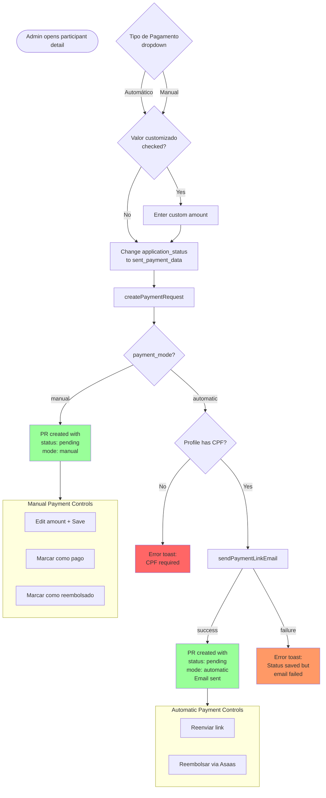
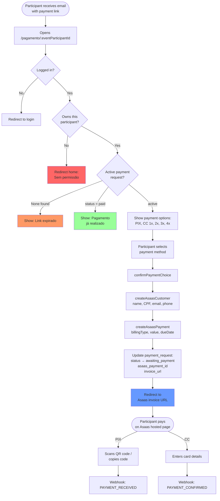
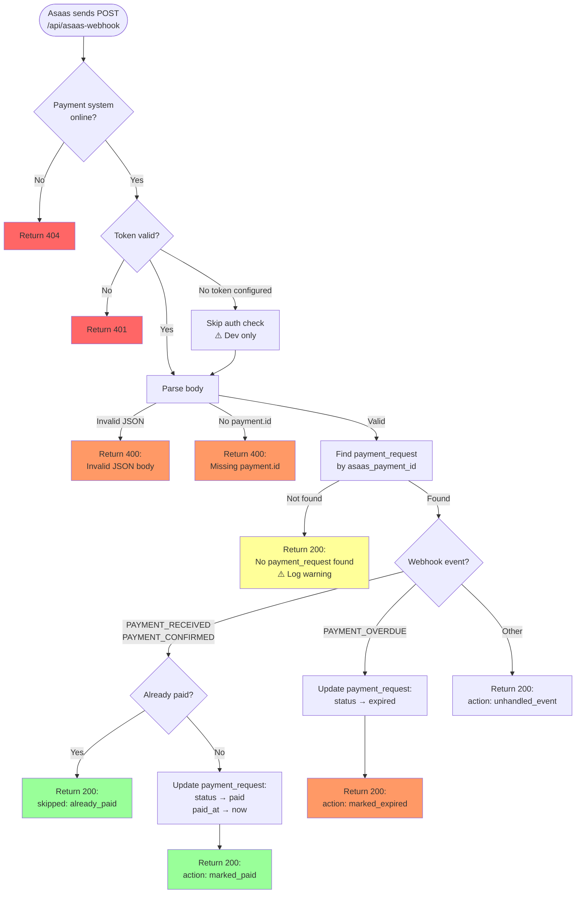
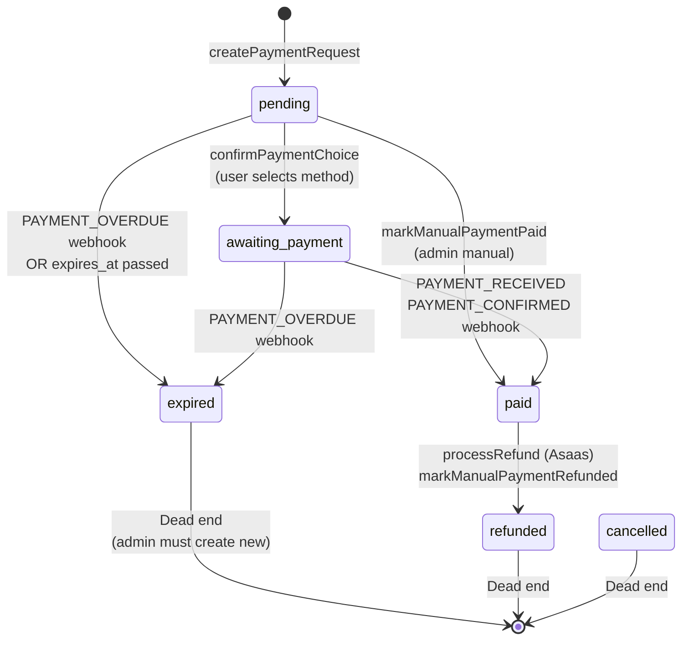
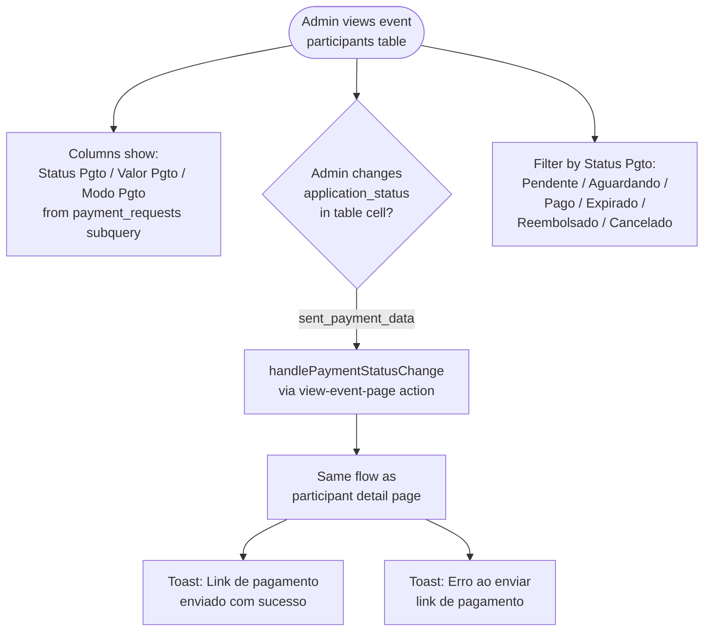

# Payment System Flow Diagram

## Overview

```mermaid
graph TB
    subgraph "Sources of Truth"
        PR[(payment_requests)]
    end

    subgraph "External"
        ASAAS[Asaas API]
        EMAIL[AWS SES Email]
    end

    subgraph "Admin Actions"
        A1[Change status to<br/>sent_payment_data]
        A2[Resend payment link]
        A3[Mark manual as paid]
        A4[Update manual amount]
        A5[Refund automatic]
        A6[Mark manual as refunded]
    end

    subgraph "Participant Actions"
        P1[Open payment page]
        P2[Select payment method]
        P3[Pay on Asaas]
    end

    subgraph "Webhook Events"
        W1[PAYMENT_RECEIVED]
        W2[PAYMENT_CONFIRMED]
        W3[PAYMENT_OVERDUE]
    end

    A1 -->|creates row| PR
    A2 -->|updates amount| PR
    A3 -->|status → paid| PR
    A4 -->|updates amount| PR
    A5 -->|status → refunded| PR
    A6 -->|status → refunded| PR

    A1 -->|if automatic| EMAIL
    A2 -->|always| EMAIL
    A5 -->|refund call| ASAAS

    P2 -->|creates customer + payment| ASAAS
    P2 -->|status → awaiting_payment| PR

    W1 -->|status → paid| PR
    W2 -->|status → paid| PR
    W3 -->|status → expired| PR
```

---

## Admin Flow: Triggering a Payment

---

## Participant Flow: Paying

---

## Webhook Flow

---

## Payment Request Status Transitions

---

## Data Table Flow (Spreadsheet View)

---

## Payment Modes Comparison

| Feature | Automatic (Asaas) | Manual |
|---------|-------------------|--------|
| **Triggered by** | Admin + PAYMENT_SYSTEM_ONLINE=true | Admin chooses Manual OR PAYMENT_SYSTEM_ONLINE=false |
| **Email sent** | Yes (with payment link) | No |
| **Payment page** | Participant uses it | Not used |
| **Asaas integration** | Customer + Payment created | None |
| **Webhook updates** | Yes (PAYMENT_RECEIVED, etc.) | No |
| **Admin can edit amount** | No (Asaas manages) | Yes |
| **Admin marks paid** | No (webhook does it) | Yes (button) |
| **Admin refund** | Via Asaas API | Manual status change |
| **CPF required** | Yes | No |

---

## Known Limitations

1. **Custom amount only works from participant detail page** — the data table view doesn't have a custom amount input, so changing status to sent_payment_data from the table always uses event's ticket_price.
